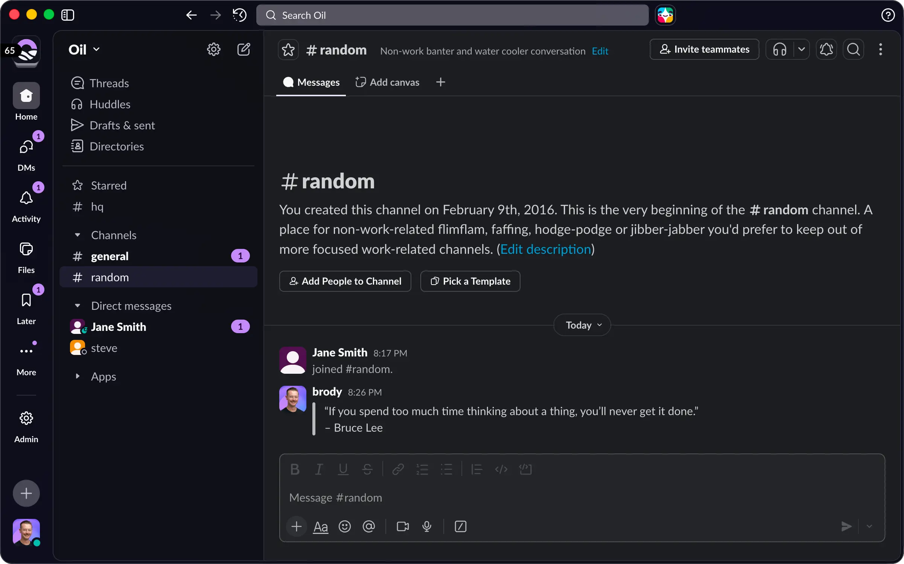

# Oil for [Slack](https://www.slack.com)

A visually appealing dark theme designed for clarity.

<br>



## Install

1. From your desktop, click your profile picture in the top right.
2. Select _`Preferences`_.
3. Click _`Themes`_.
4. Below _`Colors`_, click _`Create a custom theme`_.
5. Paste the values below.

```text
#11111B,#1E1E2E,#47BAAE,#BD8DF3
```

## License

[MIT License](./LICENSE)
